<table border="0">
  <tr>
    <td width="50%" valign="top">
      
    </td>
    <td width="50%" valign="top">
      

        <h1>Tristan Dumoulin</h1>
        <h3>Étudiant FullStack @ Zone01</h3>
        

          <b>Recherche alternance 24 mois</b> 
          <i>(Mai 2026)</i>
        

      

      

      

        
      

    </td>
  </tr>
</table>

   
  
  
  

